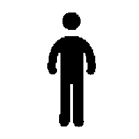

Лабораторная работа №1
========================================================

Задание
-------------------------

Получить изображение похожее на исходное с помощью генетического алгорима.

Ход работы
-------------------------

Импортируем нужные библиотеки и загружаем эталон.

```{r}
library("png")
library("rgenoud")

logo = readPNG("homo.png")
```



Далее обозначим размеры картинки и количество генов в хромосоме

```{r}
imageSize=dim(logo)

nrows = imageSize[1]
ncols = imageSize[2]

Num = 4*100
```

Напишем функцию вывода изображения текущей хромосомы

```{r}
imageNum=0

DrawImage <- function(xx,filename="")
{
  outImageMatrix=matrix(1,nrow=nrows,ncol=ncols)
  len = length(xx)/4
  summ=0
  for (i in 1:len)
  {
    x1=xx[(i-1)*4+1]
    y1=xx[(i-1)*4+2]
    x2=xx[(i-1)*4+3]
    y2=xx[(i-1)*4+4]
    outImageMatrix[y1:y2,x1:x2] = 0 
  }
  if (filename=="")
    writePNG(outImageMatrix, sprintf("result/%06d.png",imageNum))
  else
    writePNG(outImageMatrix, sprintf(filename,imageNum))
  imageNum <<- imageNum+1
}
```

Напишем фитнес-функцию для генетического алгоритма

```{r}
f <- function(xx)
{
  len = length(xx)/4
  imageMatrix=matrix(1,nrow=nrows,ncol=ncols)
  #summ=0
  for (i in 1:len)
  {
    x1=xx[(i-1)*4+1]
    y1=xx[(i-1)*4+2]
    x2=xx[(i-1)*4+3]
    y2=xx[(i-1)*4+4]
    imageMatrix[y1:y2,x1:x2] = 0 
    #summ=summ+sum(logo[y1:y2,x1:x2])
  }
  sub = imageMatrix-logo
  sub[sub<0]<-0
  summ = sum(sub)
  
  sub = logo-imageMatrix
  sub[sub<0]<-0
  summ = summ + sum(sub)
  DrawImage(xx)
  return (summ)
}
```

Запустим генетический алгорим с помощью genoud

```{r}
dom = c(1,ncols,1,nrows,1,ncols,1,nrows)
m = matrix(dom,nrow=Num,ncol=2,byrow=TRUE)

res = genoud(fn=f,max.generations=100,nvars=Num,Domains=m,pop.size=100,data.type.int=TRUE,boundary.enforcement=2)
```

Получим результат
```{r}
rectangles = res$par

DrawImage(rectangles,filename="output.png")
```


